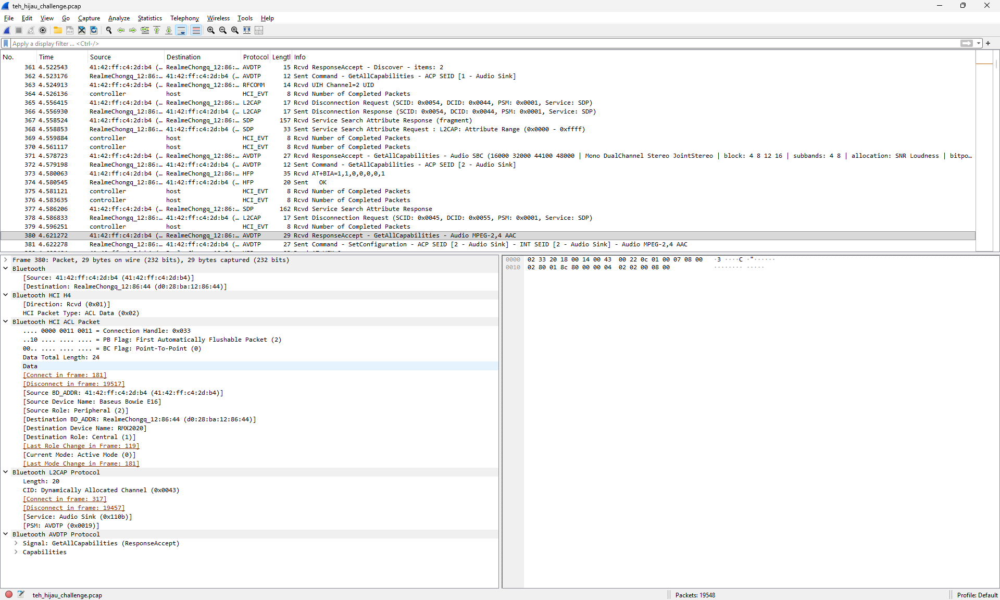
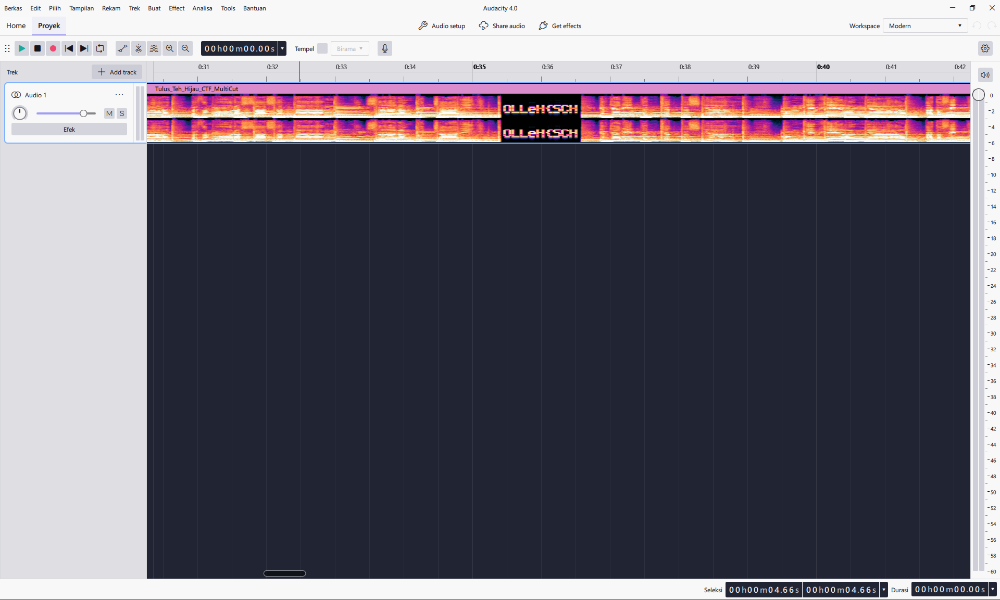
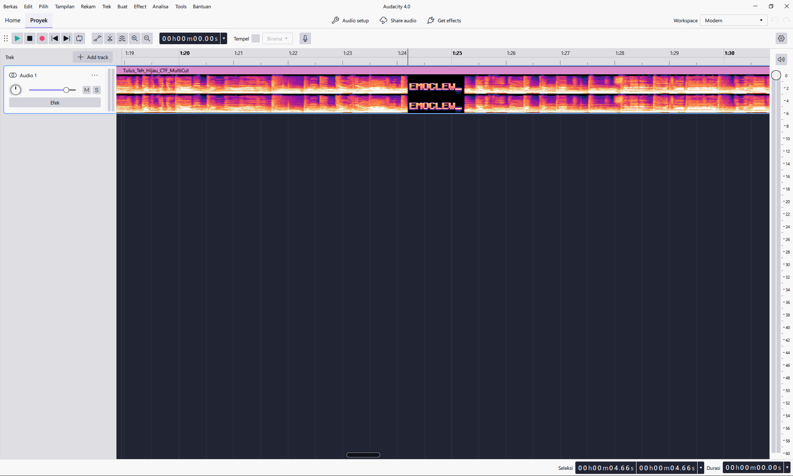
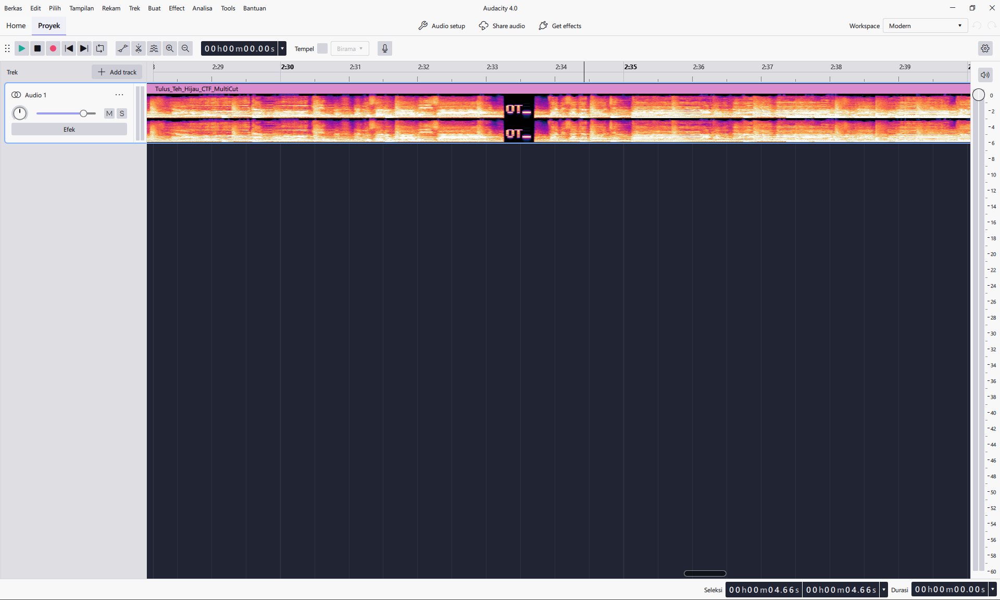
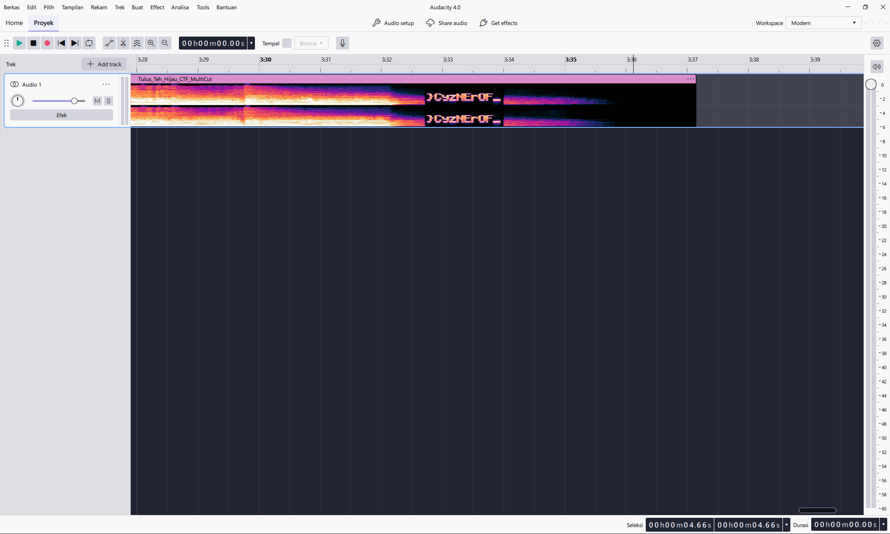

# greentea

### Analisis Paket Wireshark 

Pertama, kita buka file `teh_hijau_challenge.pcap` di Wireshark. Dari tampilan awal, terlihat protokol traffic data Bluetooth (**HCI H4, L2CAP, AVDTP**).

1. Kita filter paket kontrol Bluetooth A2DP:
   ```text
   btavdtp
   ```
2. Pada frame 380 & 381, kita melihat proses negosiasi codec audio (*SetConfiguration*):
   * **Source Device:** `RealmeChongq_12:86:44 (RMX2020)`
   * **Destination (TWS):** `Baseus Bowie E16`
   * **Codec yang digunakan:** **MPEG-2,4 AAC**, 44.100 Hz, Stereo.
   * **Channel ID (CID) L2CAP Media:** `0x0056` (Channel tempat audio dikirim).



---

### Cek Stream Audio di Menu Wireshark

Sebagai peserta CTF, insting pertama saat melihat traffic VoIP / Audio streaming adalah mengecek menu Telephony:
1. Buka menu atas: **Telephony $\rightarrow$ RTP $\rightarrow$ RTP Streams**.
2. Muncul 1 stream aktif:
   * **Payload Type:** `MPEG Audio`
   * **Total Paket:** `9483 packets` (0% packet loss)
   * **Durasi:** `~220 detik` (~3 menit 40 detik)
   

3. Kita klik stream tersebut, lalu klik tombol **Export** di kanan bawah $\rightarrow$ simpan file dengan nama **`teh_hijau_challenge.rtp`**.

---

### Audio Carving (.rtp to .wav)

Wireshark tidak bisa memutar audio codec AAC secara langsung di dalam aplikasinya. 

Maka dari itu, kita buat script Python sederhana untuk:
1. Mengupas (strip) 12-byte header RTP dari tiap paket di file `.rtp`.
2. Membungkus payload AAC ke dalam format container **LOAS / LATM** (menambahkan syncword `0x2B7` dan panjang frame).
3. Mengonversinya menjadi file `.wav` menggunakan **FFmpeg**:

```python
import struct, subprocess

#read payload file .rtp
payloads = []
with open('teh_hijau_challenge.rtp', 'rb') as f:
    f.readline() # Header text
    f.read(16)   # Header binary
    while True:
        rec = f.read(8)
        if len(rec) < 8: break
        length, plen, offset = struct.unpack('>HHI', rec)
        data = f.read(plen)
        if len(data) >= 12:
            payloads.append(data[12:]) # Buang 12-byte header RTP

# wrap ke format LOAS (Low-Overhead Audio Stream)
with open('stream.loas', 'wb') as f:
    for p in payloads:
        hdr = (0x2B7 << 13) | (len(p) & 0x1FFF)
        f.write(struct.pack('>I', hdr)[1:] + p)

# decode ke file WAV
subprocess.run(['ffmpeg', '-y', '-i', 'stream.loas', 'lagu_hasil_ekstrak.wav'])
```

Setelah script dijalankan, file **`lagu_hasil_ekstrak.wav`** berhasil keluar!

---

### Step 4: Investigasi Audio (Mendengarkan Lagu)

Kita putar file `lagu_hasil_ekstrak.wav`:
* Terdengar alunan lagu **Tulus - Teh Hijau**.
* Namun di beberapa detik tertentu:
  * Di menit **00:36**
  * Di menit **01:25**
  * Di menit **02:33**
  * Di menit **03:33**
* Musik tiba-tiba dijeda, dan terdengar suara melengking aneh (*robotic screeching / high pitch tone*).
* **Insting Forensik CTF:** Suara melengking buatan komputer di tengah jeda musik ini adalah **Spectrogram Steganography**!

---

### Step 5: Visualisasi Spectrogram di Audacity

1. Buka file `lagu_hasil_ekstrak.wav` di **Audacity**.
2. Klik panah kecil di samping nama track di sebelah kiri $\rightarrow$ ubah tampilan dari **Waveform** ke **Spectrogram** (atau tekan shortcut `Shift + S`).
3. Zoom ke 4 titik jeda tadi. Terlihat jelas tulisan matriks dot-pixel hijau di frekuensi 1 kHz – 4 kHz:

* **Titik 1 (~00:36):** `OLLeH{SCH`


* **Titik 2 (~01:25):** `EMOCLEW_`


* **Titik 3 (~02:33):** `OT_`


* **Titik 4 (~03:33):** `}CyzNErOF_`


---

### Step 6: Rekonstruksi Flag

Teks di spectrogram terlihat terbalik (*backwards / right-to-left*):
* `OLLeH{SCH` $\rightarrow$ jika dibalik: `HCS{HeLLO`
* `EMOCLEW_` $\rightarrow$ jika dibalik: `_WELCOME`
* `OT_` $\rightarrow$ jika dibalik: `_TO`
* `}CyzNErOF_` $\rightarrow$ jika dibalik: `_FOrENzyC}`

> **FLAG:**  
> `HCS{HeLLO_WELCOME_TO_FOrENzyC}`