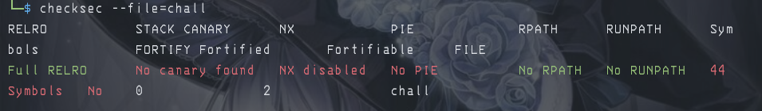
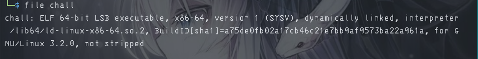
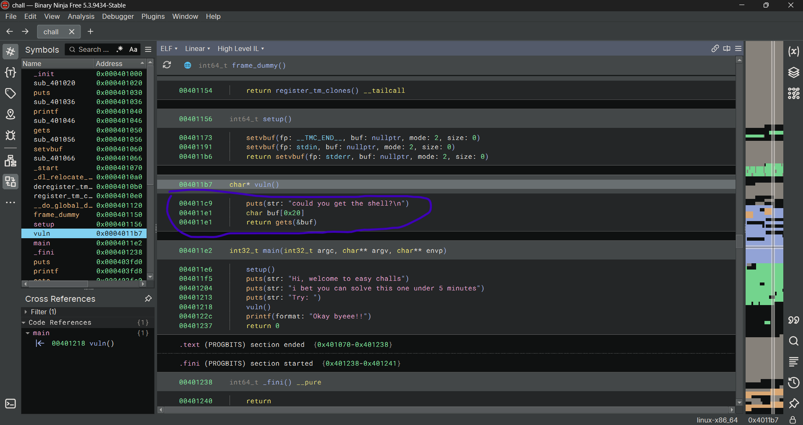
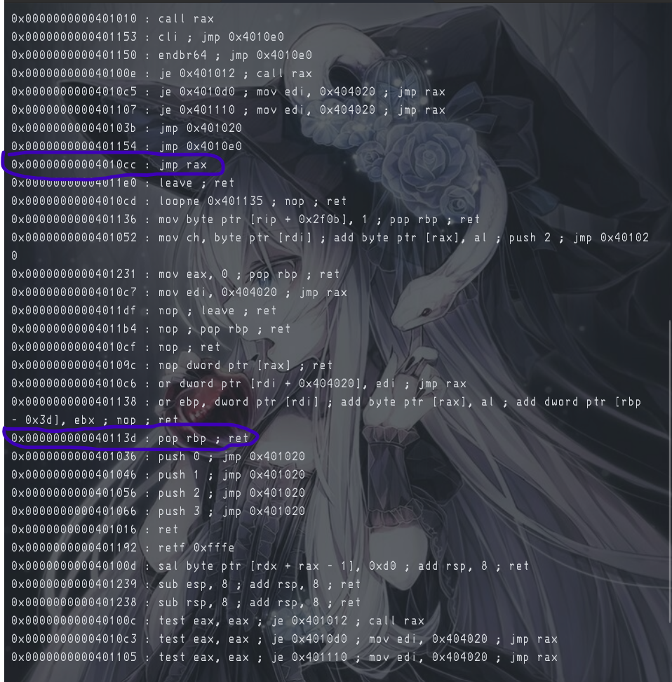
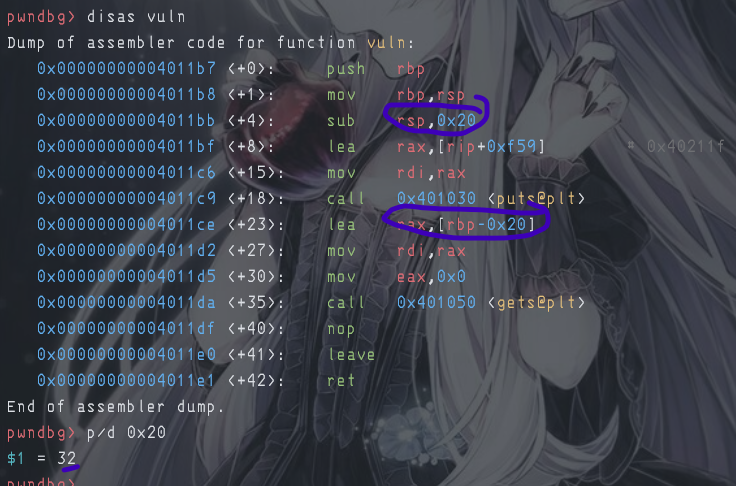

# 『sign-up』

For information, here the chall:

[chall](../release/chall)

and

This is enough information for us how to exploit actually. All of securities are off meaning:

nx disabled -> you can spawn shell in here
pie off -> static memory address
canary off -> you can buffer as much as you can

then if you open decompiler (whatever it is), the vuln is buffer overflow:

which mean you can try to search the offset. After that how you gain shell with the 1 gadget?

Well actually there are 2 interesting gadgets in here. `jmp rax` and `pop rbp; ret`

Location of this gadget:

`jmp rax`: 0x4010cc
`pop rbp; ret`: 0x40113d

Then if you use gdb / pwndbg, you can see the offset 

32 input + 8 for overflow it = 40 bytes. This is the offset. 

> Okay but how to get shell now?

You can read this one:

- https://guyinatuxedo.github.io/06-bof_shellcode/csaw17_pilot/index.html
- https://teamrocketist.github.io/2017/09/18/Pwn-CSAW-Pilot/
- https://ir0nstone.gitbook.io/notes/binexp/stack/reliable-shellcode/ret2reg/using-ret2reg

This is ret2reg, there are 2 solver in this one:

- [mirai-solver](./mirai-solver.py)
- [mine](./solver.py)

1 solver for extra:

- [solver-2](./solver-2.py) reference: https://kynxsoft.medium.com/solving-the-no-love-challenge-staged-shellcode-in-a-tight-space-fbdaddea29a0