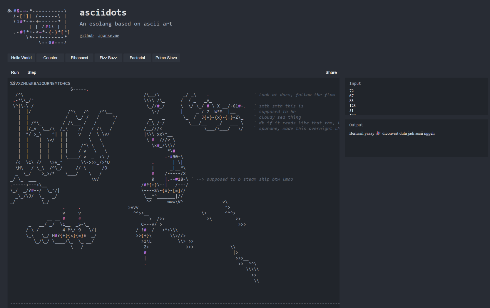

# PoC - ArtSci

Basically just do the XOR for each thing one by one lmao

Each `#$` is always followed by two thingies:

1. `{+}` with a number (this is technically `(i * 7)` but it'd take too long to figure out the looping so i didnt LMAO)
2. `{x}` with 90, this is the key stream (? drk if u wana call it that lmoa)

and then it checks for equivalence `{=}` with some number.

So basically, formula is $(\text{input}_i + \text{K}_i) \oplus 90 == \text{C}_i$,

since XOR self-inverts, $\text{input}_i = (\text{C}_i \oplus 90) - \text{K}_i$

don.

